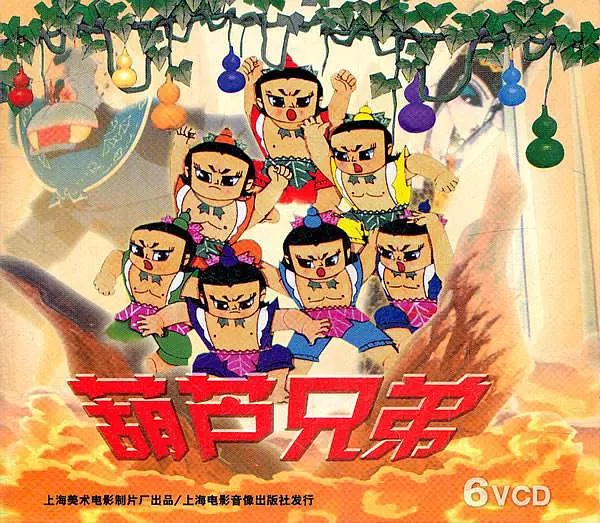

# Calabash Brothers

Calabash brothers' grandfather has been caught by the snake spirit, in order to save their grandfather, the brothers need to fuse together into a single boy called diamond brother with the powers of all of them to beat the snake spirit. Each calabash brother can chooses whether use their own skill or not when fusing, there are many ways to fuse, but only when they form a tree structure rooted at diamond brother can make damage to the snake spirit. The final score of damage is defined by the sum of all different fused trees, and the score of a single fused tree is defined by the product of all edge weights in the tree.

Now, assume there are $n$ calabash brothers and one diamond brother and you have the table of every possible edge weight, you need to find a solution for how each calabash brother chooses their skill that maximize the final score of damage.

Formally, let $X = (X_{1}, X_{2},..., X_{n})$ be the calabash brothers (e.g $X_{1}=0$ means the big brother chooses not use his skill and $X_{1}=1$ means use his skill) and $x = {x_{1},x_{2},...,x_{n}}$ be an assignment to which action they choose, given an assignment $x$, we can construct a complete directed graph $G_{x}=(V_{x}, E_{x})$ such that:

- $V_{x}=\{x_{0}, x_{1},...,x_{n}\}$ where $x_{0}$ is a dummy root node (the diamond brother) and $x_{i} 1\leq i \leq n$ is the $i$-th calabash brother's choice.
- $E_{x}=\{(x_{i}, x_{j})| i \neq j, 0\leq i \leq n, 1\leq j \leq n\}$

We assume that the relation between $x_{1},...,x_{n}$ form a forest structure(a set of trees), by adding an edge from the dummy root node $x_{0}$ to the root of each tree , we can obtain a single tree structure that is a directed tree of the graph $G_{x}$ rooted at $x_{0}$. We denote this tree by $T=(V_{T}, E_{T})$ where $V_{T} = V, E_{T} \subseteq E_{x}$.

We assign each edge of $E$ a weight $w$, define the weight of a tree $T=(V_{T}, E_{T})$ as the product of the edge weights:

$$w(T) = \prod_{(x_{i}, x_{j})\in E_{T}} w_{ij}$$

The final score is the sum over the weights of all possible trees for a given assignment $x$, We denote this value as $Z_{x}$.

$$Z_{x}= \sum_{T \in T(G_{x})}w(T) =\sum_{T \in T(G_{x})} \prod_{(x_{i}, x_{j})\in E_{T}} w_{ij}$$

where $T_{G_{x}}$ is the set of all possible trees.

You need to design an algorithm to find:

$$\mathop{\arg\max}_{x} \ \ Z(x).$$

Here is an example:

There are two calabash brothers and one diamond brother, the table of weights is as following:

|  id  |    Edge     | Weight |
|:----:|:-----------:|:------:|
| 1 | $(X_{1} = 0, X_{2} = 0)$ | 0.1 |
| 2 | $(X_{1} = 0, X_{2} = 1)$ | 0.3 |
| 3 | $(X_{1} = 1, X_{2} = 0)$ | 0.4 |
| 4 | $(X_{1} = 1, X_{2} = 1)$ | 0.2 |
| 5 | $(X_{2} = 0, X_{1} = 0)$ | 0.3 |
| 6 | $(X_{2} = 0, X_{1} = 1)$ | 0.1 |
| 7 | $(X_{2} = 1, X_{1} = 0)$ | 0.2 |
| 8 | $(X_{2} = 1, X_{1} = 1)$ | 0.4 |
| 9 | $(Root, X_{1} = 1)$ | 0.2 |
| 10 | $(Root, X_{1} = 0)$ | 0.1 |
| 11 | $(Root, X_{2} = 1)$ | 0.4 |
| 12 | $(Root, X_{2} = 0)$ | 0.3 |

The table of each assignment and it's final score is as following:

| assignment | possible trees | score |
|:----------:|:--------------:|:-----:|
| $(X_{1} = 0, X_{2} = 0)$ | TODO | $0.1 \times 0.3 + 0.1 \times 0.1 + 0.3 \times 0.3 = 0.13$ |
| $(X_{1} = 0, X_{2} = 1)$ | TODO | $0.1 \times 0.4 + 0.1 \times 0.3 + 0.4 \times 0.2 = 0.15$ |
| $(X_{1} = 1, X_{2} = 0)$ | TODO | $0.2 \times 0.3 + 0.2 \times 0.4 + 0.3 \times 0.1 = 0.17$ |
| $(X_{1} = 1, X_{2} = 1)$ | TODO | $0.2 \times 0.4 + 0.2 \times 0.2 + 0.4 \times 0.4 = 0.28$ |

So your algorithm is expected to return the assignment $X_{1} = 1, X_{2} = 1$ and the maximum final score 0.28.
