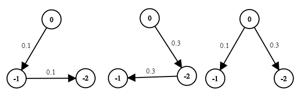
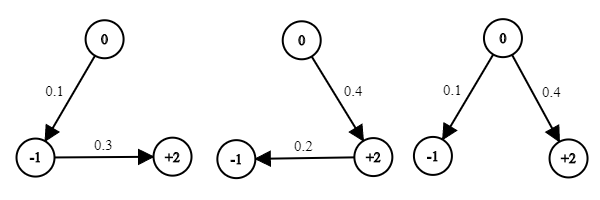
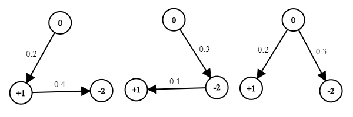
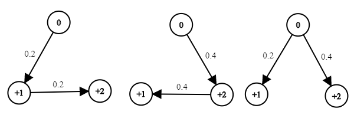

# Calabash Brothers


There are N calabash brothers numbered with 1, 2, ..., N. Each of them has a skill, which they may choose to use or not. So each of them has two states: positive if he uses the skill and negative if not. For example, if K uses his skill, his state is +K, otherwise -K. When the N brothers come together, they can transform into a new calabash brother called the Diamond brother, numbered with 0. Diamond is a fusion of the N brothers and is incredibly powerful, though he has no skill and only one state 0. Once transformed into Diamond, the N brothers can no longer change their states. The power of Diamond depends on the states of the N brothers in the following complicated way. After the transformation, all the brothers including Diamond are connected by energy links that can form various tree structures in which Diamond is always the root. Edges in the trees are directed from parent nodes to child nodes. The power or weight of a possible directed edge depends on the two brothers connected by the edge and the states of the two brothers. The power of a tree structure is the product of the edge weights in the tree. Finally, the power of Diamond is the summation of the power of all possible tree structures. We would like to determine the states of the N brothers such that the power of Diamond is as large as possible. 

## Input

The first line is an integer N. In the following 4N<sup>2</sup>-2N lines, each line has 3 numbers U, V, W, which means the weight of the edge from U to V is W.

## Output

The output has only one line, which contains N integers representing the states of the N brothers, separated by space.

## Sample

The sample input below indicates that there are 2 calabash brothers and a Diamond. There are 4 possible choices of the states of the two brothers: -1, -2; -1, +2; +1, -2; +1, +2. The corresponding total powers are as follows.

| Choices |            All Trees             |            Total Power             |
| :-----: | :------------------------------: | :--------------------------------: |
| -1, -2  |  | 0.1x0.1 + 0.3x0.3 + 0.1x0.3 = 0.13 |
| -1, +2  |  | 0.1x0.3 + 0.4x0.2 + 0.1x0.4 = 0.15 |
| +1, -2  |  | 0.2x0.4 + 0.3x0.1 + 0.2x0.3 = 0.17 |
| +1, +2  |  | 0.2x0.2 + 0.4x0.4 + 0.2x0.4 = 0.28 |

When we choose +1, +2, we get the maximum total power 0.28. So we should output +1 +2.

### Sample Input

```
2
-1 -2 0.1
-1 +2 0.3
+1 -2 0.4
+1 +2 0.2
-2 -1 0.3
-2 +1 0.1
+2 -1 0.2
+2 +1 0.4
0 -1 0.1
0 +1 0.2
0 -2 0.3
0 +2 0.4
```

### Sample Output

```
+1 +2
```

## Getting Started

The starter code [calabash.py](calabash.py) contains a very simple solution implemented with Python 2.7 and NumPy, which can be easily installed with [Anaconda](https://www.anaconda.com/download/). With Anaconda installed, we can run `python calabash.py`, paste the sample input into the terminal, and then we will get the sample output +1 +2.

## Evaluation

Your score of the project positively correlates with the total power of your output. We will give 10 inputs to you to test your algorithm. For each input, you should write your output to the file under the folder [output](output) with the same name as the input. You will get a percentile rank R for each input, and your project score for this input is -2log(R). For example, R = 0.11, which means you are the top 11% among all students in our class, and you will get score -2log(0.11) = 4.415. Your final project score is the summation of your scores of the 10 inputs.

### Submitting

Submit your output for each input to [Gradebot](https://gradebot.org/). See [Gradebot User's Manual](http://gradebot.org/gradebot/static/user.html) for help. Below is the time table of each input. We will release each input under the folder [input](input) on its start day.

|  Input  |   N   |    Start   |     End    |
| :-----: | :---: | :--------: | :--------: |
|    1    | 69    | 2017-11-20 | 2017-12-10 |
|    2    | 180   | 2017-11-27 | 2017-12-17 |
|    3    | 500   | 2017-12-04 | 2017-12-24 |
|    4    | 1058  | 2017-12-11 | 2017-12-31 |
|    5    | 100   | 2017-12-18 | 2018-01-07 |
|    6    | 100   | 2018-12-25 | 2018-01-14 |
|    7    | 294   | 2018-01-01 | 2018-01-21 |
|    8    | 500   | 2018-01-01 | 2018-01-21 |
|    9    | 910   | 2018-01-01 | 2018-01-21 |
|    10   | 1556  | 2018-01-01 | 2018-01-21 |

**IMPORTANT**

- When you submit your outputs, you should also submit all the source code that you write; otherwise, you will be treated as cheating.
- It is your responsibility to guarantee that the submitted code can reproduce all your outputs. Any irreproducible result will be treated as cheating.
- Plagiarism detection software will be used to identify possible cheating.
- Any cheating will result in a zero score.

## Hints

After the states are determined, all the chosen states and Diamond form a graph, and the power of Diamond with the chosen states can be found in O(N<sup>3</sup>) time by the [matrix-tree theorem](http://people.reed.edu/~davidp/412/handouts/matrix-tree.pdf), which has been implemented in [calabash.py](calabash.py).

A tractable exact solver may not exist. Instead of exactly solving the problem, you can employ various approximation strategies. The following are some ideas that you may consider.

### Randomized Algorithms

Randomly generate some choices and find the maximum power of them. This method has been implemented in [calabash.py](calabash.py).

### Greedy Algorithms

Similar to [Prim's algorithm](https://en.wikipedia.org/wiki/Prim's_algorithm), start from 0 and greedily choose the maximum available edges.

### Local Search

Randomly initialize a choice of states, and then repeatedly try to change some states in the choice to make the power larger.

### Dynamic Programming

Choose a tree structure of the brothers first, and then find the best states in the tree using dynamic programming.
